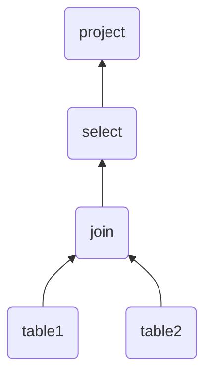
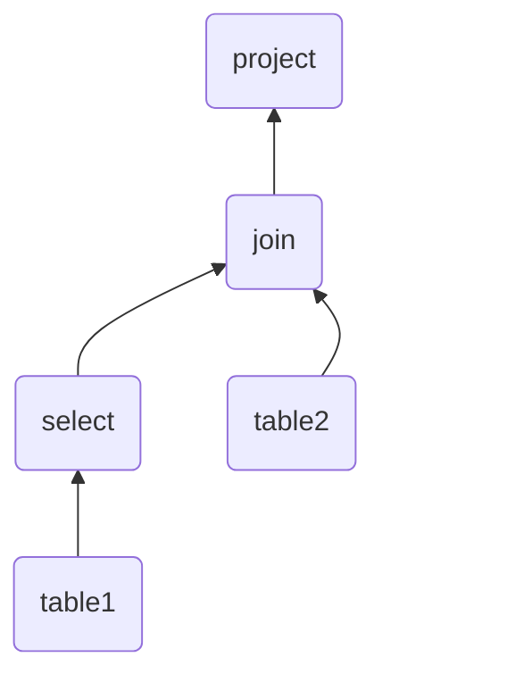

The first step of query processing: this simply converts SQL code into a parse tree of operations; standard 6.1010 fare.

Here's a basic parse tree for a potential query. We read the tables at the bottom, join them, select the rows we want, then project to the columns we want.

Note that multiple query trees can correspond to the same query. For example, you'll probably want to [[The Relational Data Model and Relational Algebra#^d64f56|predicate push-down]] the select to under the join, assuming that it is a function of the columns of one of the tables:

This is a responsibility of the next few sections.

---

**Next:** [[Query Rewriting]]
